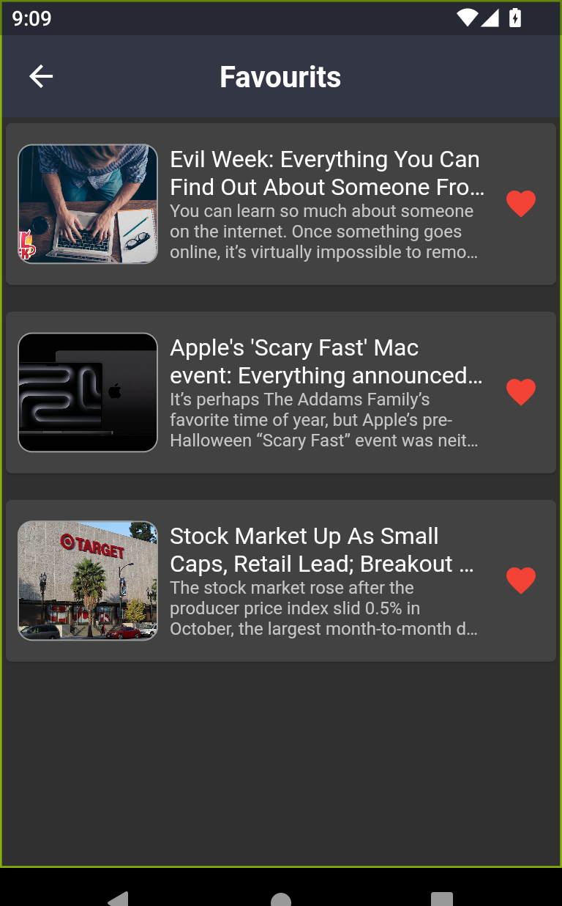
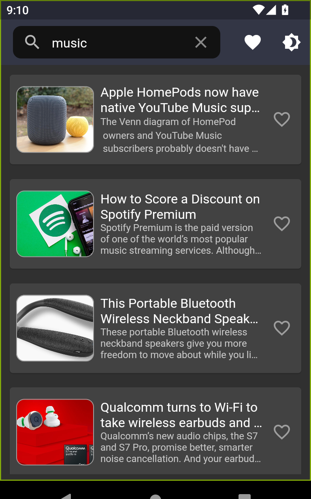

# 🔥 Flutter Boklo News App

An App based on **NewsAPI** to browse the latest news from different sources and categories.

## ✨ Features :

- Clean Architecture.
- Bloc State Management.
- NewsAPI.
- Caching data/Offline.
- Beautiful UI and Animation.
- Saving favorite news.
- Search for news.
- Dark/Light Mode.
- Responsive UI.

## 📸 Screenshots :

 
 

## 📹 Video Demo : [Flutter Boklo News App](https://drive.google.com/file/d/1m7sjGgxri3HIfoK2ttVzOZEgWMcGtbF3/view?usp=sharing)